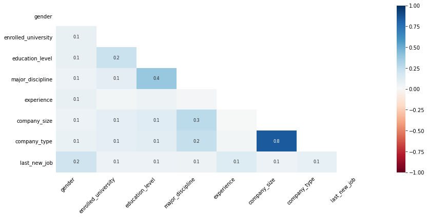
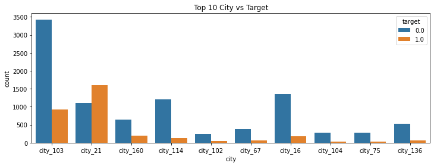
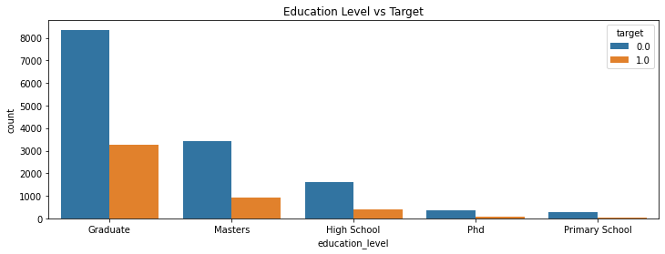
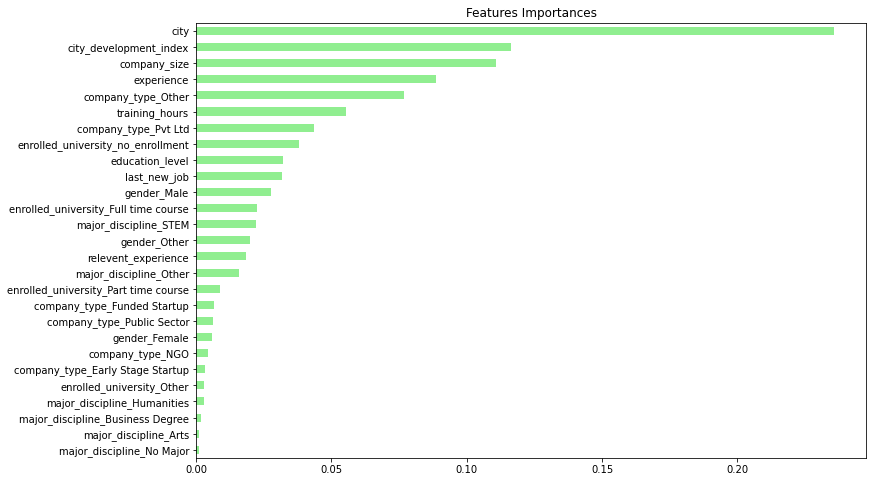

# HR Analytics: Job Change of Data Scientists

This dataset is designed to understand the factors that cause a person to want to work for the company. The goal of this project is to build a model that uses existing credentials, demographics, and experience to predict a candidate's likelihood of working for the company.

## Data

* enrollee_id : Unique ID for candidate
* city: City code
* city_ development _index : Developement index of the city (scaled)
* gender: Gender of candidate
* relevent_experience: Relevant experience of candidate
* enrolled_university: Type of University course enrolled if any
* education_level: Education level of candidate
* major_discipline :Education major discipline of candidate
* experience: Candidate total experience in years
* company_size: No of employees in current employer's company
* company_type : Type of current employer
* lastnewjob: Difference in years between previous job and current job
* training_hours: training hours completed
* target: 0 – Not looking for job change, 1 – Looking for a job change

## Missing data

## Visual EDA

## Preprocessing data

Since the education_level property is an ordered category, the difference between the categories has been increased numerically to make the difference between the categories more obvious. Likewise, categories were created by calculating average values in the company_size property. Apart from these, some modifications and data type corrections were made.

In order to prevent data leakage, categorical variable encoding is done after the data is separated as train and test. The LeaveOneOutEncoder method was used because the city variable is a categorical variable with high cardinality. Then, the OneHotEncoder method is used, as variables such as gender, enrolled_university, major_discipline, company_type are nominal variables.

## Handling imbalanced dataset

The SMOTEENN method, which combines oversampling and undersampling, is used to overcome the problem of imbalanced data.

## Result

In general, I tried to show what was done in the project. If you want to examine it in more detail, <a href = 'https://www.kaggle.com/gokberkyucelkaya/hr-analytics-job-change-of-data-scientists'>you can reach the notebook here.</a>
